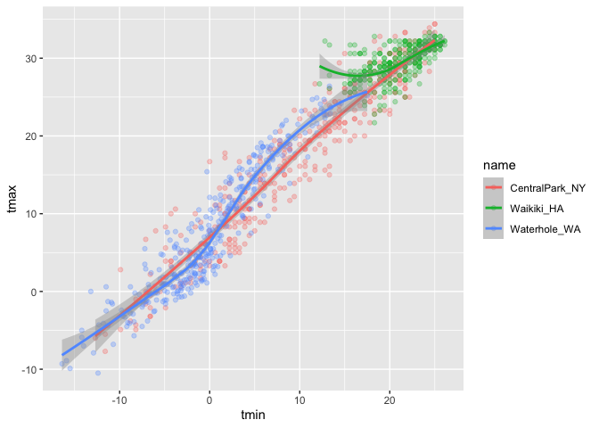

viz_part_01
================
Margaret
2022-10-10

\##lets import data

``` r
library(tidyverse)
```

    ## ── Attaching packages ─────────────────────────────────────── tidyverse 1.3.2 ──
    ## ✔ ggplot2 3.3.6      ✔ purrr   0.3.4 
    ## ✔ tibble  3.1.8      ✔ dplyr   1.0.10
    ## ✔ tidyr   1.2.0      ✔ stringr 1.4.1 
    ## ✔ readr   2.1.2      ✔ forcats 0.5.2 
    ## ── Conflicts ────────────────────────────────────────── tidyverse_conflicts() ──
    ## ✖ dplyr::filter() masks stats::filter()
    ## ✖ dplyr::lag()    masks stats::lag()

``` r
library(ggridges)
```

This is from the website

``` r
weather_df = 
  rnoaa::meteo_pull_monitors(
    c("USW00094728", "USC00519397", "USS0023B17S"),
    var = c("PRCP", "TMIN", "TMAX"), 
    date_min = "2017-01-01",
    date_max = "2017-12-31") %>%
  mutate(
    name = recode(
      id, 
      USW00094728 = "CentralPark_NY", 
      USC00519397 = "Waikiki_HA",
      USS0023B17S = "Waterhole_WA"),
    tmin = tmin / 10,
    tmax = tmax / 10) %>%
  select(name, id, everything())
```

    ## Registered S3 method overwritten by 'hoardr':
    ##   method           from
    ##   print.cache_info httr

    ## using cached file: ~/Library/Caches/R/noaa_ghcnd/USW00094728.dly

    ## date created (size, mb): 2022-09-19 20:14:31 (8.402)

    ## file min/max dates: 1869-01-01 / 2022-09-30

    ## using cached file: ~/Library/Caches/R/noaa_ghcnd/USC00519397.dly

    ## date created (size, mb): 2022-09-19 20:14:38 (1.697)

    ## file min/max dates: 1965-01-01 / 2020-02-29

    ## using cached file: ~/Library/Caches/R/noaa_ghcnd/USS0023B17S.dly

    ## date created (size, mb): 2022-09-19 20:14:42 (0.95)

    ## file min/max dates: 1999-09-01 / 2022-09-30

We are going to make a scatterplot now

``` r
ggplot (weather_df, aes(x=tmin, y=tmax)) +
  geom_point()
```

    ## Warning: Removed 15 rows containing missing values (geom_point).

<!-- -->
Let make the same scatterplot, but different. The filtering step now
indicates that we are only looking at central park data.

``` r
weather_df %>%
  drop_na()%>%
  filter (name =="CentralPark_NY")%>%
  ggplot (aes(x=tmin, y=tmax)) +
  geom_point()
```

<!-- -->
Lets keep making the same plot but different. This now gives us the same
blank plot as before.

``` r
weather_scatterplot =
  weather_df %>%
  drop_na()%>%
  ggplot (aes(x=tmin, y=tmax))
```

This then gives us the actual scatterplot now.

``` r
weather_scatterplot + 
  geom_point()
```

<!-- -->

\#Lets make this fancier. This made it colorful. It colors it by the
“name” variable

``` r
weather_df%>%
  ggplot (aes(x=tmin, y=tmax, color = name)) +
  geom_point()
```

    ## Warning: Removed 15 rows containing missing values (geom_point).

<!-- -->

You can define aesthetic mapping for certain geometries. the geom smooth
runs a line through the middle of your dataset to see if there is a
linear association going on here in the data.

``` r
weather_df %>%
   ggplot (aes(x=tmin, y=tmax)) +
  geom_point(aes (color = name)) +
  geom_smooth()
```

    ## `geom_smooth()` using method = 'gam' and formula 'y ~ s(x, bs = "cs")'

    ## Warning: Removed 15 rows containing non-finite values (stat_smooth).

    ## Warning: Removed 15 rows containing missing values (geom_point).

<!-- -->

This is the same plot but it makes the 3 different lines based on
“name”. it applied both to the scatterplot and the “name” variable.
Anything in the ggplot() applis it to all scatterplots. If put in the
geom_plot(), it only applies to the scatterplot

``` r
weather_df %>%
   ggplot (aes(x=tmin, y=tmax, color = name)) +
  geom_point() +
  geom_smooth()
```

    ## `geom_smooth()` using method = 'loess' and formula 'y ~ x'

    ## Warning: Removed 15 rows containing non-finite values (stat_smooth).

    ## Warning: Removed 15 rows containing missing values (geom_point).

<!-- -->

It is hard to see everything going on in the plot. so in the
geom_smooth(), we are going to define a specific parameter. We are not
mapping alpha to a variable. We are defining alpha as .3 (alpha is
between 0 and 1). Alpha is blending/making it more or less transparent
with 0 being completely transparent.In this graph, the grey shaded
regions on the lines are error bars.

``` r
weather_df %>%
   ggplot (aes(x=tmin, y=tmax, color = name)) +
  geom_point(alpha = .3) +
  geom_smooth()
```

    ## `geom_smooth()` using method = 'loess' and formula 'y ~ x'

    ## Warning: Removed 15 rows containing non-finite values (stat_smooth).

    ## Warning: Removed 15 rows containing missing values (geom_point).

<!-- -->

Getting rid of error bars.

``` r
weather_df %>%
   ggplot (aes(x=tmin, y=tmax, color = name)) +
  geom_point(alpha = .3) +
  geom_smooth(se = FALSE)
```

    ## `geom_smooth()` using method = 'loess' and formula 'y ~ x'

    ## Warning: Removed 15 rows containing non-finite values (stat_smooth).

    ## Warning: Removed 15 rows containing missing values (geom_point).

<!-- -->
Maybe make separate panels. we are now going to tell ggplot make this
plot but separate it by whatever variable we want to seaprate it by.
This made it create 3 separate4 charts that is seaprated by the 3 names.
In the facet_grid(), the left . defines the row and the name defines the
columns of the charts.

``` r
weather_df %>%
   ggplot (aes(x=tmin, y=tmax, color = name)) +
  geom_point(alpha = .3) +
  geom_smooth(se = FALSE) +
  facet_grid(. ~ name )
```

    ## `geom_smooth()` using method = 'loess' and formula 'y ~ x'

    ## Warning: Removed 15 rows containing non-finite values (stat_smooth).

    ## Warning: Removed 15 rows containing missing values (geom_point).

<!-- -->

`tmax` and `tmin` is boring. Lets spice it up. Lets look at maximum
trends of seasonal temp with the precipitation variabole be a part of
this too. This shows the usual temp profile of these 3 diff places with
precipitation. Now you have a precipiation variabole with diff colors.

``` r
weather_df%>%
  ggplot (aes(x = date, y = tmax, color = prcp)) +
  geom_point(alpha = .3) +
  geom_smooth(se = FALSE) +
  facet_grid(. ~ name)
```

    ## `geom_smooth()` using method = 'loess' and formula 'y ~ x'

    ## Warning: Removed 3 rows containing non-finite values (stat_smooth).

    ## Warning: Removed 3 rows containing missing values (geom_point).

<!-- -->

Doing precipitation by color may not be totally useful. Here is it with
size differences.

``` r
weather_df%>%
  ggplot (aes(x = date, y = tmax, color = name)) +
  geom_point(aes(size = prcp), alpha = .3) +
  geom_smooth(se = FALSE) +
  facet_grid(. ~ name)
```

    ## `geom_smooth()` using method = 'loess' and formula 'y ~ x'

    ## Warning: Removed 3 rows containing non-finite values (stat_smooth).

    ## Warning: Removed 3 rows containing missing values (geom_point).

<!-- -->

## univariate plots

histograms, barplots, boxplots, violins….

This is not great bc it stacks the historgrams on top of each other.

``` r
weather_df %>%
  ggplot(aes( x = tmax, fill = name)) +
  geom_histogram()
```

    ## `stat_bin()` using `bins = 30`. Pick better value with `binwidth`.

    ## Warning: Removed 3 rows containing non-finite values (stat_bin).

<!-- -->

Then we should separate the historgrams with facet_grid()

``` r
weather_df %>%
  ggplot(aes( x = tmax, fill = name)) +
  geom_histogram() + 
  facet_grid(. ~ name)
```

    ## `stat_bin()` using `bins = 30`. Pick better value with `binwidth`.

    ## Warning: Removed 3 rows containing non-finite values (stat_bin).

<!-- -->

Lets see more options. Instead of separating, use geom_density(). can
also use ggplot(aes(x = tmax, fill = name)) to fill in the density plot
by name.

``` r
weather_df %>% 
  ggplot(aes(x = tmax, color = name)) +
  geom_density() 
```

    ## Warning: Removed 3 rows containing non-finite values (stat_density).

<!-- -->

Boxplots!

``` r
weather_df %>%
  ggplot(aes(x = name, y = tmax)) +
  geom_boxplot()
```

    ## Warning: Removed 3 rows containing non-finite values (stat_boxplot).

<!-- -->

Violin plot- same as boxplot but also with density. This would be
helpful if you are comparing 20-30 stations.

``` r
weather_df %>%
  ggplot(aes(x = name, y = tmax)) +
  geom_violin()
```

    ## Warning: Removed 3 rows containing non-finite values (stat_ydensity).

<!-- -->
OR you can take the density graphs and stack them on top of each other
with geom_density_ridges().

``` r
weather_df %>%
  ggplot(aes(x = tmax, y = name)) +
  geom_density_ridges()
```

    ## Picking joint bandwidth of 1.84

    ## Warning: Removed 3 rows containing non-finite values (stat_density_ridges).

<!-- -->

\##saving and embedding plots

``` r
weather_scatterplot = 
  weather_df%>%
  ggplot(aes(x = date, y = tmax, color = name, size = prcp)) +
  geom_point(alpha = .3) +
  geom_smooth (se = FALSE) +
  facet_grid (. ~ name)

weather_scatterplot
```

    ## `geom_smooth()` using method = 'loess' and formula 'y ~ x'

    ## Warning: Removed 3 rows containing non-finite values (stat_smooth).

    ## Warning: Removed 3 rows containing missing values (geom_point).

<!-- -->

``` r
ggsave("results/weather_scatterplot.pdf", weather_scatterplot, width = 8, height = 5)
```

    ## `geom_smooth()` using method = 'loess' and formula 'y ~ x'

    ## Warning: Removed 3 rows containing non-finite values (stat_smooth).
    ## Removed 3 rows containing missing values (geom_point).
